
<h1 align="center">基于SSM的高校共享单车管理系统+vue</h1>

## 简介
高校共享单车管理系统：角色分为管理员、用户；功能包括单车信息管理、区域信息管理、租赁订单管理、租还订单管理、用户管理和支付管理，提供简洁的界面和易用的操作体验。    --计算机毕业设计源码；毕设源码；java毕业设计源码

## 联系方式

<h3 align="center">获取完整代码与数据库文件 + 微信：deepguan QQ: 86050149 QQ群: 783742310</h3>

<h3 align="center">可帮忙远程部署 包运行成功！提供远程部署、修改代码、设计文档指导、代码讲解等服务！</h3>

## 功能介绍（完整见运行截图）
管理员：基本功能包括用户登录和注册，订单审核管理和支付信息监控，单车信息管理与上传，高校资讯编辑及发布，租赁订单和还车订单的审核和处理，生成与查看租赁及用户统计数据。用户管理功能允许调整用户权限及维护用户信息，确保系统运作及处理故障。界面设有导航菜单，便于访问个人中心、数据统计和费用管理。

用户：提供账号注册与登录，浏览单车信息，并支持更新个人资料，进行密码修改。用户可通过界面查看可用单车实时信息，选择合适单车租赁，系统会记录租赁时间和归还地点。用户可访问个人中心进行订单查询和修改，并通过多种支付方式完成租赁交易，查看租金流水及维护费用等数据统计。页面导航便捷，支持单车及租赁信息的录入与管理。

## 运行截图
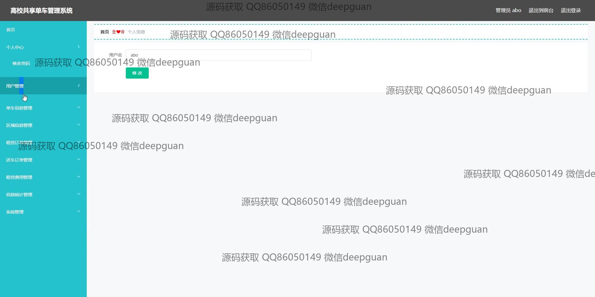
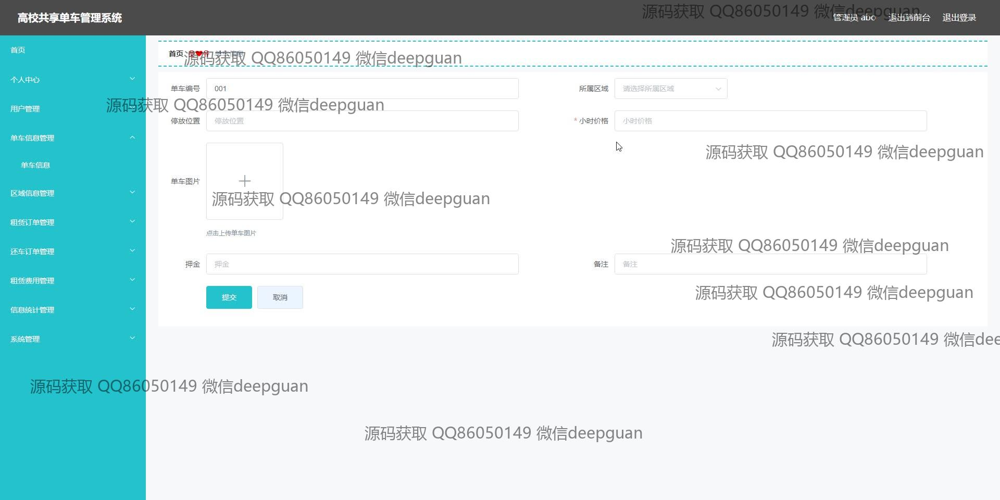

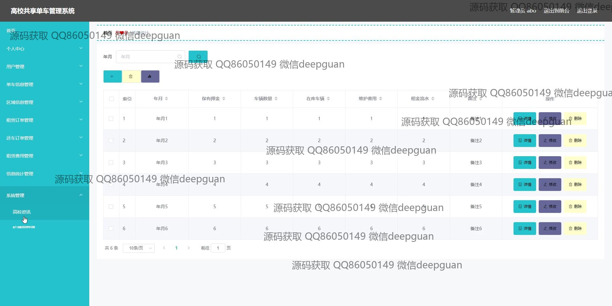
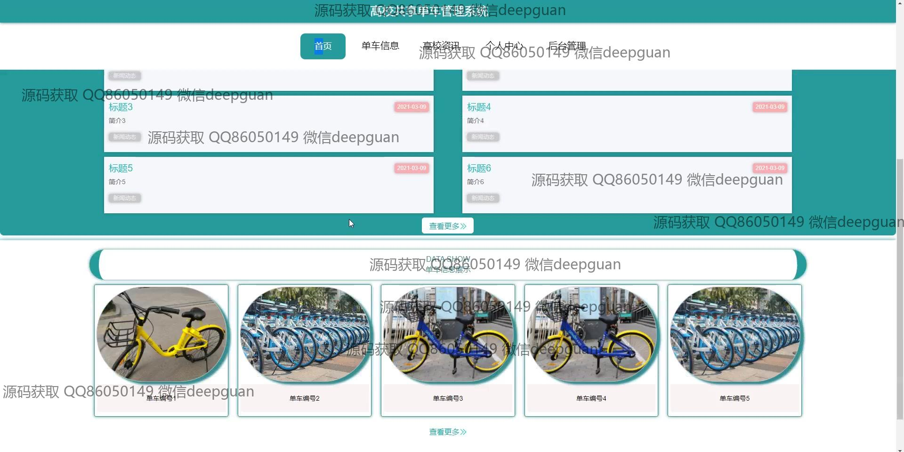
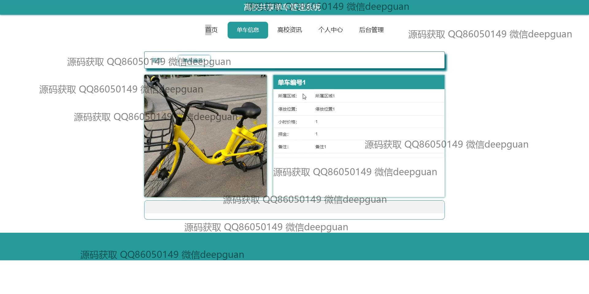
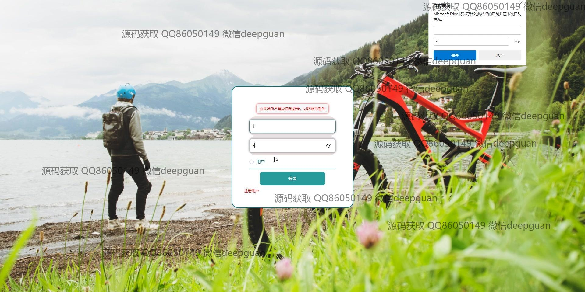
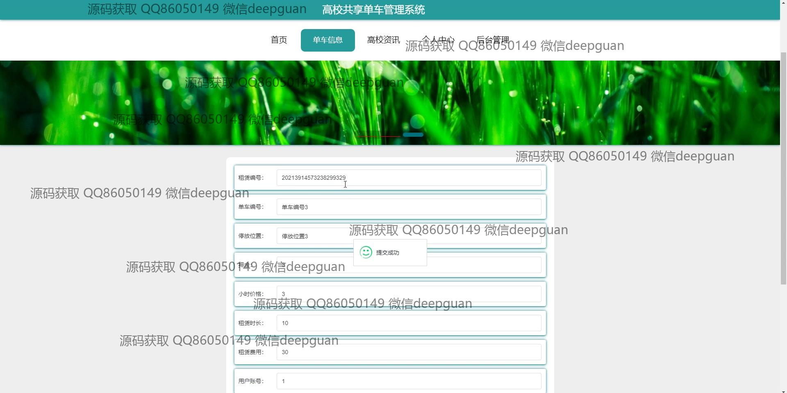
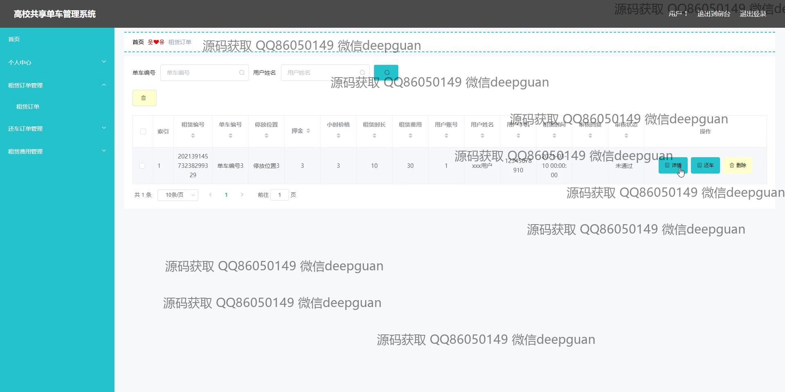
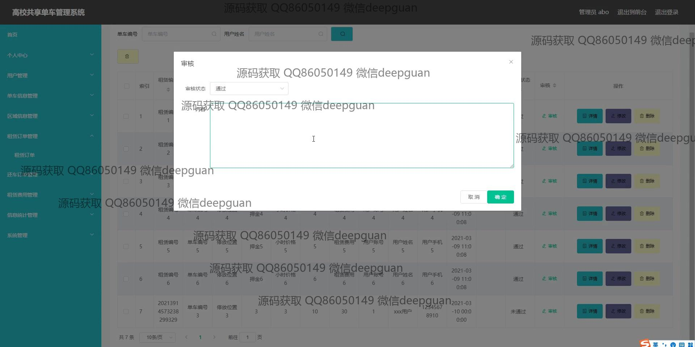
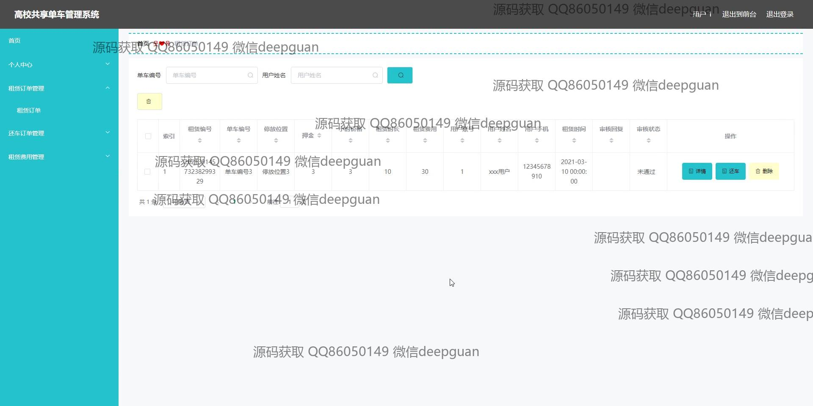
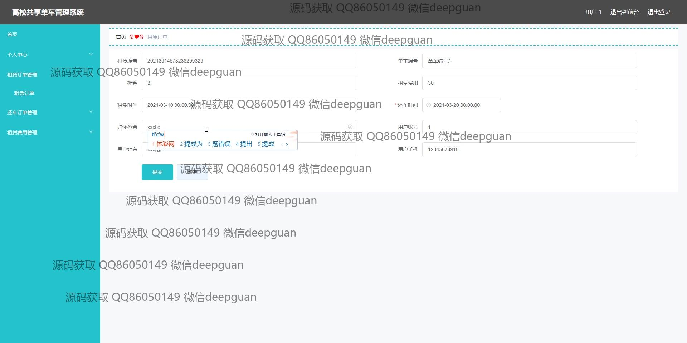
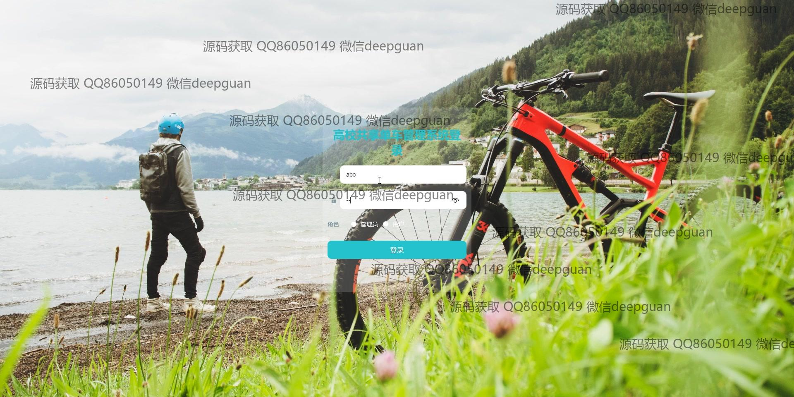
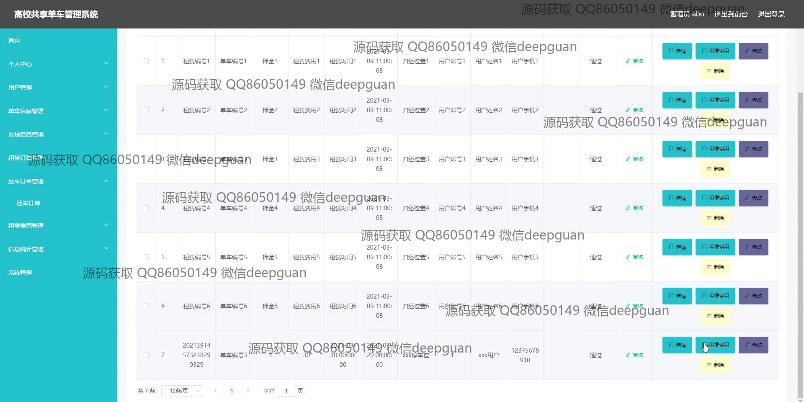
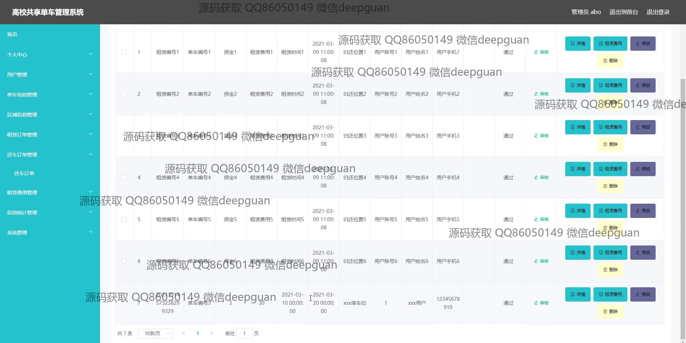
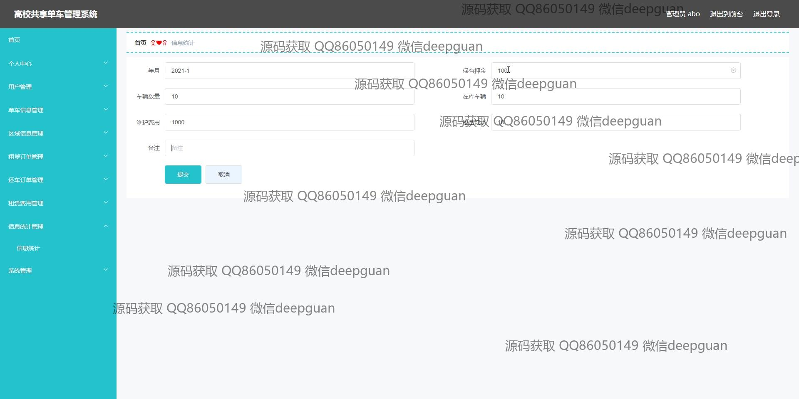
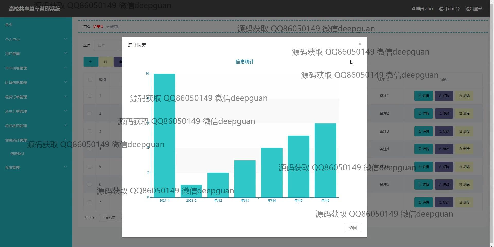
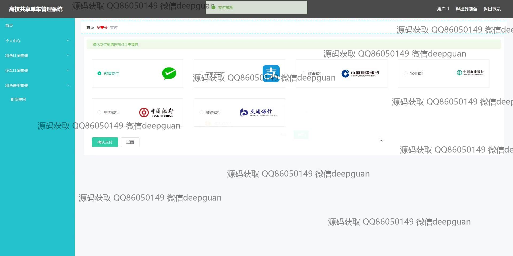

本代码来源于网络,仅供学习参考使用!

